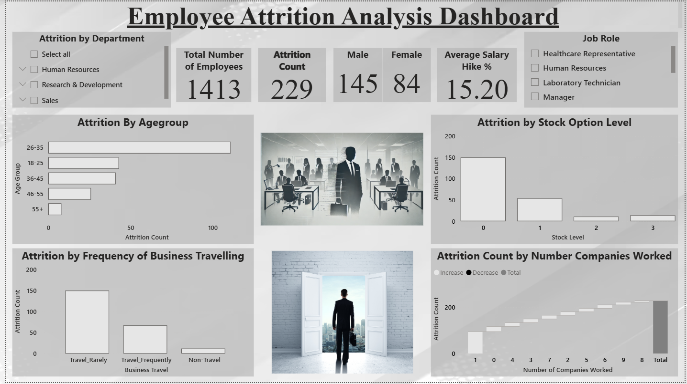

# Employee Attrition Dashboard – Power BI 📊

This project is an interactive **Employee Attrition Analysis** dashboard built using **Power BI** to explore trends related to employee turnover, job satisfaction, salary hikes, and department-wise attrition risk.

---

## 🧠 Project Overview

The goal of this project is to identify key patterns that contribute to employee attrition by analyzing various HR-related parameters. It aims to uncover potential risk factors and guide HR teams in making data-driven decisions to improve retention strategies.

---

## 📁 Files Included

| File Name                | Description                                  |
|--------------------------|----------------------------------------------|
| `Attrition project.pbix` | Final Power BI Dashboard file                |
| `dataset.xlsx`           | HR dataset used in the analysis              |
| `Attrition project.pdf`  | PDF version of the dashboard/storyboard      |
| `DashboardScreenshot.png`| Static snapshot of the dashboard             |
| `Dashboard Record.gif`   | Short dashboard interaction demo (GIF)       |

---

## 📸 Dashboard Preview

---

## 🎬 Live Demo (GIF)

---

## 💡 Key Insights

- 🔺 **Sales** and **R&D** departments show the highest attrition rates.
- 🧓 **Mid-level employees** are more likely to leave compared to freshers or seniors.
- 💼 **Job satisfaction** and **stock options** play a crucial role in employee retention.
- 💬 Recommendations: Reevaluate incentive policies, improve internal mobility, and conduct regular engagement surveys.

---

## 🛠️ Tools & Technologies Used

- **Power BI** – Dashboard creation and KPI visualization
- **Excel** – Data preprocessing

---

## 📌 Project Motivation

Understanding employee attrition helps organizations reduce turnover costs and improve employee satisfaction. With real-time dashboards, HR departments can take proactive steps to retain talent.

---

## 👨‍💻 Author

**Avik Sarkhel**  
🎓 MCA | Aspiring Data Analyst  
📫 [avik305sarkhel@gmail.com](mailto:avik305sarkhel@gmail.com)  
🔗 [LinkedIn](https://www.linkedin.com/in/avik-sarkhel/)

---

> 🚀 Feel free to fork or reuse this project as a starting point for your own HR analytics dashboard!

